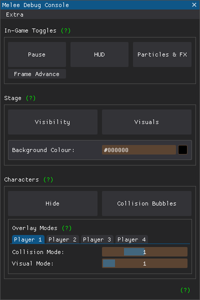

# Melee Debug Console
A simple GUI to control various aspects of Super Smash Bro's Melee.

## Panel Layout

## Installation and Tips
Download the latest [release](https://github.com/sadkellz/Melee-Debug-Console/releases),
and run.

*Hold right click and drag to move the panel.*
## Socials
[ko-fi](https://ko-fi.com/sadkellz)

[twitter](https://twitter.com/sadkellz)